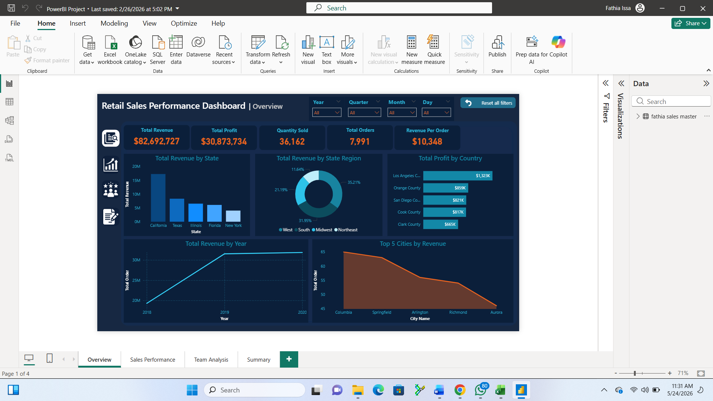
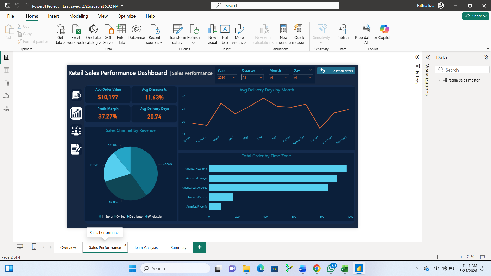
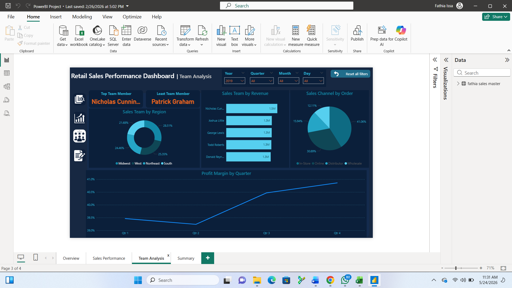

# Retail Sales Performance Dashboard

## Project Overview
This project analyzes **retail sales data** across the United States to uncover patterns in revenue, profit, team performance and sales channel efficiency. Using Power BI, I built a multi-page interactive dashboard that transforms raw transactional records into clear, actionable business insights, covering everything from geographic revenue distribution to individual sales team rankings.

The dataset spans **2018 to 2020**, covers **45 states**, and includes **7,991 orders** with a combined revenue of **$82.6M** and profit of **$30.8M**.

## Dashboard

### Page 1 — Overview

**Summary:**
The Overview page gives a high-level snapshot of business performance. It displays five KPI cards — **Total Revenue ($82.6M), Total Profit ($30.8M), Quantity Sold (36,162), Total Orders (7,991), and Revenue Per Order ($10,348)**. Supporting visuals include a bar chart of revenue by state (California leads), a donut chart breaking revenue across four U.S. regions, a ranked bar chart of the top 5 counties by profit, a trend line showing revenue growth from 2018 to 2020, and an area chart highlighting the top 5 cities by revenue. All visuals respond to slicers for Year, Quarter, Month, and Day.

### Page 2 — Sales Performance

**Summary:**
The Sales Performance page dives into operational and channel-level metrics. KPI cards show **Avg Order Value ($10,197), Avg Discount % (11.63%), Profit Margin (37.27%), and Avg Delivery Days (20.74)**. A pie chart breaks down revenue across four sales channels — **Online dominates at 40.08%**, followed by Wholesale (29.99%), In-Store (18.95%), and Distributor (10.98%). A line chart tracks average delivery days by month, and a horizontal bar chart shows total orders by U.S. time zone, with New York and Chicago leading in order volume.

### Page 3 — Team Analysis

**Summary:**
The Team Analysis page evaluates individual and regional sales team performance. It highlights the **Top Team Member (Nicholas Cunningham)** and the **Least Team Member (Patrick Graham)** for the selected period. A donut chart shows each region's share of total sales. A bar chart ranks the top 5 sales reps by revenue, all clustered around **$1.3M–$1.5M**, indicating a balanced team. A quarterly profit margin trend line shows consistent improvement from Q1 (~39.5%) through Q4 (~41%), reflecting growing team efficiency over the year.

## Dataset

The final dataset (`Sales_Master.xlsx`) was produced by **cleaning and joining 4 separate source tables in MySQL** before loading into Power BI.

### Source Tables

| Table | Rows | Description |
|---|---|---|
| `store_sales_usa` | 367 | Store locations — city, state, population, income, time zone |
| `sales_order_usa` | 7,991 | Order transactions — dates, channels, quantity, price, cost |
| `sales_team_usa` | 28 | Sales team members and their assigned regions |
| `region_usa` | 48 | U.S. state-to-region mapping (West, Midwest, South, Northeast) |

### How They Were Joined
- `sales_order_usa` is the **main table** (one row per order)
- Joined with `store_sales_usa` on `_StoreID` → to get city, county, state, and demographic info
- Joined with `sales_team_usa` on `_SalesTeamID` → to get sales rep names and regions
- Joined with `region_usa` on `StateCode` → to get the U.S. region for each order

### Final Dataset
| Field | Details |
|---|---|
| Total Records | 7,991 orders |
| Total Columns | 36 |
| Date Range | May 2018 – December 2020 |
| Geographic Coverage | 45 U.S. states |
| Sales Channels | In-Store, Online, Distributor, Wholesale |

## Tools & Technologies

### 🗄️ MySQL — Data Preparation
- Imported all 4 source tables into MySQL
- Cleaned and standardized data (removed duplicates, handled nulls, fixed data types)
- Joined all tables using `_StoreID`, `_SalesTeamID`, and `StateCode` as keys
- Exported the final joined table as `Sales_Master.xlsx`

### 📊 Power BI Desktop — Dashboard Design
- Built 4 interactive report pages (Overview, Sales Performance, Team Analysis, Summary)
- Created DAX measures for KPIs (Total Revenue, Profit Margin, Avg Delivery Days, etc.)
- Designed interactive slicers for Year, Quarter, Month, and Day
- Used multiple visual types — bar charts, donut charts, line charts, area charts, KPI cards

### 🔄 Power Query — Data Transformation
- Validated data types after import
- Built date hierarchy (Year → Quarter → Month → Day)
- Created calculated columns for additional analysis

### 📁 Excel
- Used as the file format for both source data and the final Sales Master dataset

## Key Insights
- California alone accounts for the highest state revenue, nearly double Texas in second place
- Online is the dominant sales channel at 40%, suggesting a shift away from physical stores
- Profit margin improved steadily from 39.5% in Q1 to 41% by Q4 2019
- The top 5 sales reps are closely matched (~$1.3M–$1.5M each), showing a balanced team
- New York and Chicago time zones generate the highest order volumes
- Average delivery time of ~20 days suggests room for improvement in fulfillment speed

## Author
**Fathia Issa** — Data Analyst with a passion for turning raw data into clear visual stories.
[Connect with me on LinkedIn](https://www.linkedin.com/in/fathia-issa-9302b7276/)
